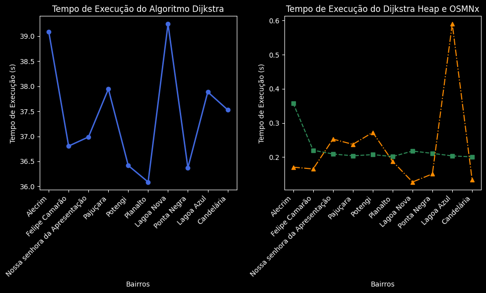
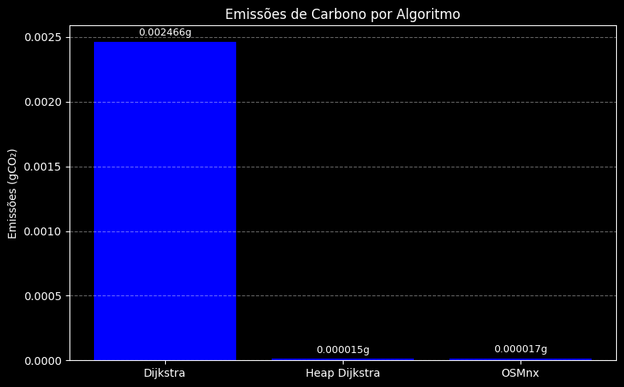

# 🚑Roteamento para Serviços de Emergência — Análise de Algoritmos de Caminho Mínimo
Este projeto tem como objetivo avaliar o desempenho de três algoritmos de caminho mínimo aplicados a um cenário de roteamento de serviços de emergência na cidade de Natal/RN. A proposta consiste em simular o deslocamento de ambulâncias partindo do Hospital Walfredo Gurgel — ponto fixo de origem — para diferentes bairros populosos da cidade, a fim de identificar as rotas mais eficientes em termos de tempo e distância.

## Responsável
- Celine Helena Abrantes de Andrade. Matrícula: 20200078207.
  ---
 ## 📁Estrutura do Repositório
- `README.md` — Este documento.
- `assets/` — Pasta contendo mapas e gráficos geradas durante o trabalho.
- `analise_menor_caminho.csv ` — Tabela com as métricas de avaliação.
- `U2T1.ipynb` —  Arquivo com o código usado.

---
## 🏥Contexto

Os serviços de urgência móvel têm como fator decisivo o tempo de resposta e necessitam que a rota traçada até o destino seja a de menor distância possível, no menor tempo, para salvar vidas. Por isso, o cenário simulado considera o envio de ambulâncias a partir do **Hospital Walfredo Gurgel**, em Natal/RN, até os bairros mais populosos da cidade. A ideia central é comparar a eficiência dos algoritmos em termos de tempo de execução, distância percorrida e pegada de carbono durante o cálculo das rotas.

---
## ⚙️ Metodologia
Toda a análise foi dividida em etapas principais:
 ###1. Coleta de dados e definição de pontos de interesse:
 - Mapa da cidade de Natal obtido por meio da biblioteca **OSMNx**.
- Seleção dos 10 bairros mais populosos de acordo com o Censo 2022.
- Mapeamento das coordenadas do ponto de origem e dos destinos.
-  Cálculo das distâncias entre nós e identificação dos vizinhos mais próximos.

### 2. Implementação dos Algoritmos
Foram utilizados três algoritmos de menor caminho:

- **Dijkstra Tradicional**  
- **Dijkstra com Min-Heap**  
- **Algoritmo embutido da biblioteca OSMNx**

Cada algoritmo foi adaptado para funcionar com o grafo gerado pelo OSMNx, e os seguintes dados foram registrados:
- Caminho gerado (lista de nós)
- Distância total da rota (em metros)
- Tempo de execução do cálculo (em milissegundos)
- Emissões de carbono estimadas com base no uso computacional

### 3. Visualização e Comparação
- Geração de mapas com as rotas traçadas para cada bairro.
- Construção de um arquivo `.csv` contendo os resultados de cada algoritmo.
- Análise comparativa dos dados em gráficos e tabelas.

---
## 📊 Resultados
A partir dos mapas gerados, é possível observar que os três algoritmos identificaram as **mesmas rotas** para todos os bairros e, consequentemente, distância percorridas idênticas. Isso indica consistência na lógica de cálculo do caminho mais curto, como mostra os mapas a seguir.

Em relação ao tempo de execução, o  **Dijkstra com min-heap** apresentou desempenho superior ao Dijkstra tradicional devido a utilizar uma estrutura de dados que permite priorizar a expansão do nó com menor distancia.  Como se trata de uma árvore mínima, o menor nó sempre estará no topo da estrutura, o que torna a busca mais eficiente. No entanto, entre os três algoritmos, o **OSMNx** foi, em média, o mais rápido, embora em alguns casos tenha sido superado pelo min-heap.

Quanto às emissões de carbono, as diferenças entre as **pegada de carbono computacional** entre os algoritmos foram pequenas. O Dijkstra com min-heap e o OSMNx apresentaram, em média, o menor impacto energético.

---
## ✅ Conclusões

É importante destacar que cada algoritmo usa diferentes natureza de grafos. Por exemplo, OSMnx trabalha  baseados em redes viárias reais, que incluem informações como ruas de mão única, curvas, entre outros detalhes. Já o algoritmo de Dijkstra geralmente opera sobre grafos mais abstratos ou simplificados. Isso pode levar a pequenas variações nas distâncias encontradas e, consequentemente, nos tempos de execução.

Para que esses algoritmos encontrem o menor caminho, considera-se a rota com menor custo — sendo o custo, neste caso, a menor distância. Portanto, se outros fatores fossem levados em consideração, como tempo de viagem (com base na velocidade permitida das vias) ou custos associados (como pedágios e consumo de combustível em diferentes tipos de estrada), os resultados poderiam divergir ainda mais.

Em suma, todos os algoritmos se mostraram eficazes para encontrar o caminho mais curto em redes urbanas reais. Além disso, foi notado que o uso de estruturas otimizadas, como min-heap, proporciona ganhos significativos de desempenho. Entre os algoritmos analisados, o **OSMNx** se destaca pela praticidade de uso e pela capacidade de lidar com grafos complexos de maneira eficiente. Em um cenário de emergência, **a escolha do algoritmo pode impactar diretamente o tempo de resposta**, especialmente quando a decisão precisa ser tomada com alta frequência e em larga escala.
Assim, este projeto demonstra a importância de se considerar não apenas a corretude do algoritmo, mas também sua eficiência prática em aplicações do mundo real.

---
## Vídeo explicativo
🎥 [Link para o vídeo no Loom](https://www.loom.com/share/0ba0187a430f4a79b246313a7c2c7598?sid=2b2790f1-061d-4ab1-82fa-a6c7ce20ef0a)
## Referências

- NetworkX documentation: https://networkx.org/
- Censo 2022: https://g1.globo.com/rn/rio-grande-do-norte/noticia/2024/11/14/censo-2022-se-fosse-uma-cidade-maior-bairro-de-natal-seria-o-7o-municipio-mais-populoso-do-rn-veja-lista.ghtml
- OSMNx documentacion: https://github.com/gboeing/osmnx-examples
- CodeCarbon documentation: https://github.com/gboeing/osmnx-examples

